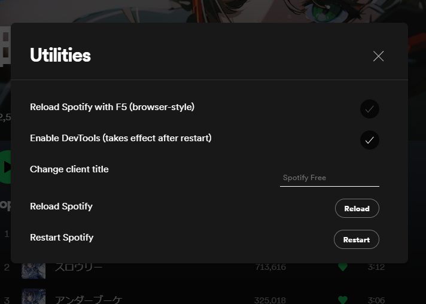

# Spicetify Utilities

Collection of niche utilities for Spicetify users and developers.

If you have another niche utility that you want to be included in this extension, feel free to open an issue or a pull request.



## Install

Copy `utilities.js` into your [Spicetify](https://github.com/spicetify/spicetify-cli) extensions directory:
| **Platform** | **Path** |
|------------|------------------------------------------------------------------------------------------|
| **Linux** | `~/.config/spicetify/Extensions` or `$XDG_CONFIG_HOME/.config/spicetify/Extensions/` |
| **MacOS** | `~/.config/spicetify/Extensions` or `$SPICETIFY_CONFIG/Extensions` |
| **Windows** | `%appdata%/spicetify/Extensions/` |

After putting the extension file into the correct folder, run the following command to install the extension:

```
spicetify config extensions utilities.js
spicetify apply
```

Note: Using the `config` command to add the extension will always append the file name to the existing extensions list. It does not replace the whole key's value.

Or you can manually edit your `config-xpui.ini` file. Add your desired extension filenames in the extensions key, separated them by the | character.
Example:

```ini
[AdditionalOptions]
...
extensions = autoSkipExplicit.js|shuffle+.js|trashbin.js|utilities.js
```

Then run:

```sh
spicetify apply
```

## Usage

Currently, the extension provides the following features:

### Reload on pressing F5

Nothing much to say about this, without enabling DevTools there aren't many ways to reload the Spotify client. Seems useful for myself.

### Enable DevTools and keeps it open

Currently Spotify prevents DevTools from being used in the following session after running `spicetify enable-devtools`. This extension will automatically enable DevTools and keep it open for you.

**Note**: The settings will be applied after restarting the client (completely closing and reopening Spotify).

### Changing the window title

This will change the window title to your desired string. Can be used to change that _slightly annoying_ Spotify Free to whatever that you want.

**Note**: Due to the method's limitation, the title will not take effect when a track is being played.